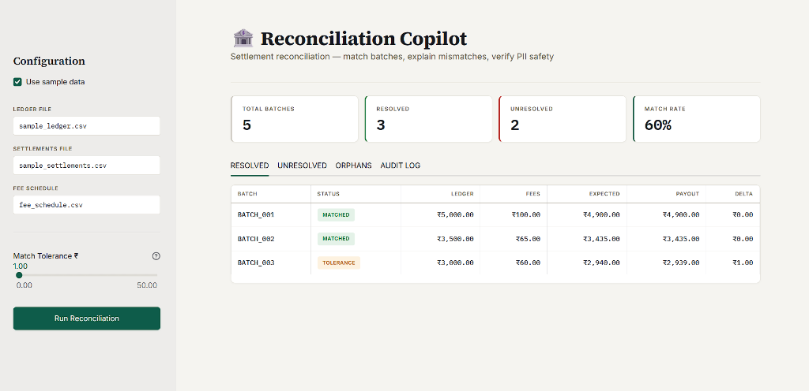
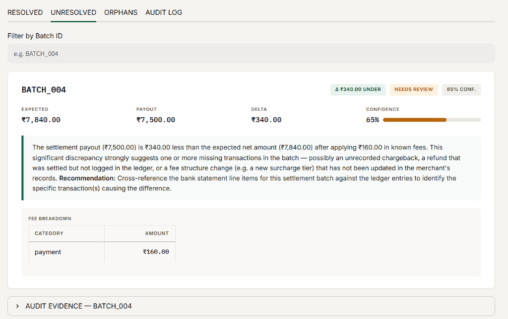
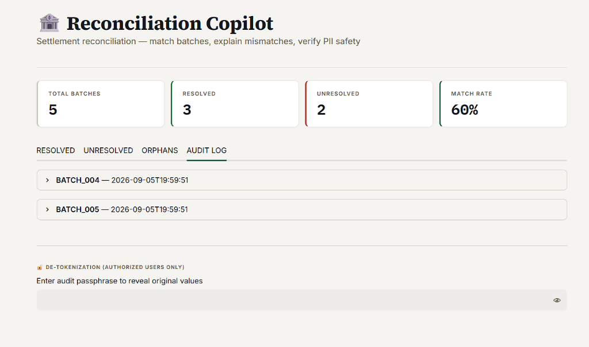

# 🏦 Reconciliation Copilot

AI-powered settlement reconciliation that detects, explains, and helps resolve mismatches between bank settlement payouts and merchant ledgers — in seconds instead of hours.

---

## Documentation Links

- [Problem Statement (RazorPay)](RazorPay_Problem_Statement.md)
- [Solution Architecture](RazorPay_Solution_Document.md)

---

## The Problem

Payment processors settle thousands of transactions daily. Each settlement batch groups multiple orders, deducts fees, and issues a net payout. When the payout doesn't match the merchant's records, operations teams manually investigate — sifting through spreadsheets, cross-referencing fee schedules, and chasing down ₹50 discrepancies across ₹50 lakh batches.

**Reconciliation Copilot** automates this:
1. **Deterministic matching** — rule-based math that's auditable and exact
2. **AI-powered explanations** — a LangGraph agent that explains *why* each mismatch happened
3. **Zero PII exposure** — sensitive data (account numbers, names, IFSC codes) is HMAC-tokenized before reaching the LLM



---

## Architecture

```
┌────────────┐    ┌────────────────┐    ┌──────────────┐    ┌──────────────┐
│  Ingestion │───▶│  Batch Matcher │───▶│  Anonymizer  │───▶│  LangGraph   │
│  (CSV I/O) │    │  (Rule-based)  │    │  (HMAC-256)  │    │  Agent       │
└────────────┘    └────────────────┘    └──────────────┘    └──────────────┘
                         │                                         │
                         │ Resolved batches                        │ Explanation +
                         ▼                                         ▼ confidence
                  ┌──────────────────────────────────────────────────────┐
                  │              Streamlit Dashboard                     │
                  │  • Metric cards  • Resolved table  • Explanations   │
                  │  • Confidence scores  • Fee breakdown  • Audit log  │
                  └──────────────────────────────────────────────────────┘
```

### Key Design Decisions

| Decision | Rationale |
|----------|-----------|
| Matching is **deterministic** (no ML) | Financial math must be auditable and reproducible |
| AI explanations are **advisory only** | No ledger correction happens automatically from an AI output |
| PII is **tokenized before** reaching the agent | HMAC-SHA-256 with a per-session secret; the PII guard is a second regex layer that blocks raw account numbers and IFSC codes |
| LLM is **injectable** via `llm_callable` | Swap between the built-in rule-based engine and a real LLM with a single parameter |

---

## Setup & Execution

### Prerequisites

- Python 3.10+

### 1. Install Dependencies

```bash
pip install -r requirements.txt
```

### 2. Launch the Dashboard

```bash
streamlit run ui/app.py
```

Open `http://localhost:8501` in your browser. Check **"Use sample data"** in the sidebar and click **🚀 Run Reconciliation**.

The dashboard shows:
- **Metric cards** — Total Batches, Matched, Tolerance-Matched, Mismatched
- **Resolved tab** — all reconciled batches with fee breakdowns
- **Unresolved tab** — AI-generated explanations with confidence scores
- **Orphans tab** — unmatched bank settlements missing from the ledger
- **Audit Log tab** — every LLM prompt logged, PII guard verification, and a de-tokenization toggle





### 3. Run Tests

```bash
# Full test suite (61 tests)
python -m pytest tests/ -v

# Just the golden evaluation
python eval/golden_set.py
```

---

## Evaluation Accuracy

All numbers below are verified against our `eval/golden_set.py` suite.

### Golden Evaluation — 17/17 (100%)

| Metric | Score |
|--------|-------|
| Classification Accuracy (matched / tolerance / mismatch) | 8/8 (100%) |
| Explanation Relevance (expected keywords found) | 4/4 (100%) |
| Confidence Calibration (score within expected range) | 4/4 (100%) |
| PII Safety (zero leaks across all LLM payloads) | PASS (8 payloads checked) |
| **Overall** | **17/17 (100%)** |

### Test Suite — 61/61 Passed

| Suite | Tests |
|-------|-------|
| `test_agent_explain.py` — PII guard, anonymizer, LangGraph agent | 15 |
| `test_matching_engine.py` — fee calculation, batch matching | 16 |
| `test_integration.py` — end-to-end pipeline, edge cases, PII paths | 30 |
| **Total** | **61** |

---

## What We Fixed (v2)

These limitations from the original version have been resolved:

| Original Limitation | Fix |
|---------------------|-----|
| **PII guard scope** — only account numbers & IFSC | Now detects **email addresses** and **Indian PAN numbers** too |
| **Orphan settlements** — silently skipped | Detected and displayed in a dedicated **ORPHANS** tab |
| **De-tokenization API** — reserved, not wired | Password-protected **de-tokenization toggle** in the Audit Log |
| **Single file pair** — one ledger + one settlement | **Multi-file upload** — concatenates multiple CSVs before processing |
| **Static fee schedule** — no time-varying rates | Supports optional **`effective_from`** date column for mid-period rate changes |

---

## Known Limitations

1. **Advisory-only AI** — explanations describe likely causes; no automatic ledger corrections (by design for financial safety)
2. **Rule-based demo LLM** — ships with a deterministic fallback; swap in a real LLM via `llm_callable`
3. **Single currency (INR)** — cross-currency settlements need a conversion layer and live exchange rates

---

## License

MIT License. Built for the Razorpay Hackathon.
